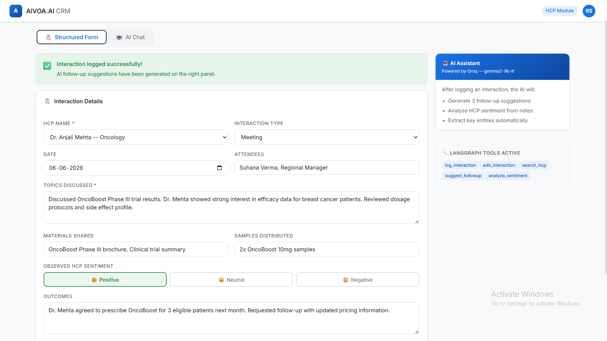
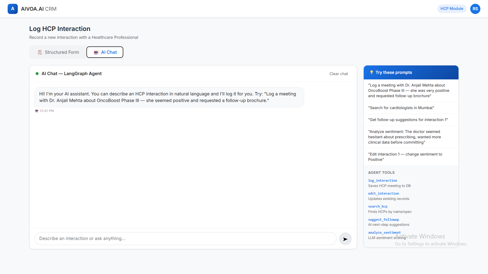
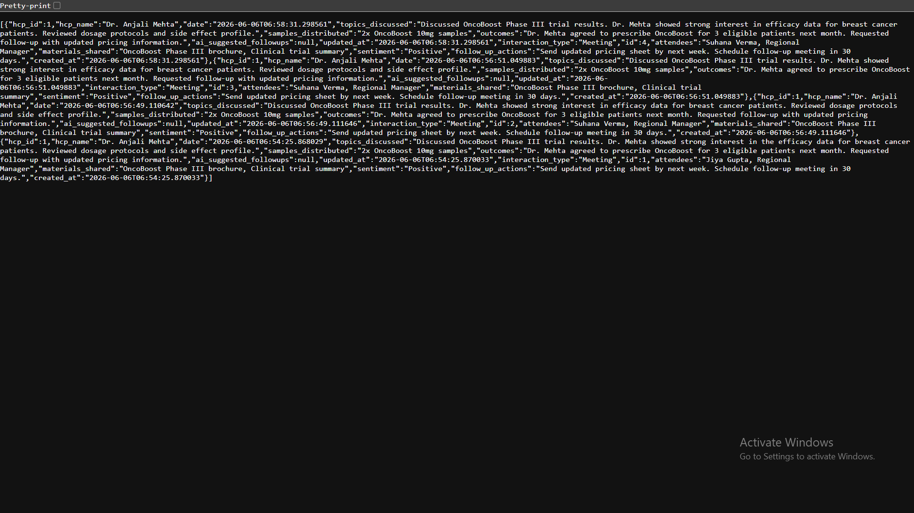

# AIVOA AI-First CRM — HCP Module

> A production-grade AI-first CRM system for pharmaceutical sales teams to manage Healthcare Professional (HCP) interactions using **LangGraph multi-agent architecture**, **Groq LLM**, **FastAPI**, and **React**.

---

## 🚀 Live Demo

> Local deployment (FastAPI + React + SQLite)
> Backend: `http://localhost:8000` | Frontend: `http://localhost:5173`

---

## 📸 Screenshots

### Structured Interaction Form + AI Assistant Panel


### AI Chat Interface



### Logged Interaction Data


---

## 🧠 What This Project Does

MIRA-style CRM built for **pharmaceutical field representatives** to:

- Log detailed meetings with doctors (HCPs) via a **structured form** or **natural language chat**
- Get **AI-generated follow-up suggestions** after every interaction
- Analyze **HCP sentiment** (Positive / Neutral / Negative) from interaction notes
- **Search HCPs** by name, specialty, or region
- Edit and retrieve past interaction records

---

## ⚙️ Tech Stack

| Layer | Technology | Purpose |
|-------|-----------|---------|
| Frontend | React + Redux + Vite | Interactive UI with state management |
| Backend | Python + FastAPI | REST API with async support |
| AI Agent | LangGraph | Multi-agent orchestration |
| LLM | Groq (gemma2-9b-it) | Fast LLM inference for AI features |
| Database | SQLite (dev) / MySQL (prod) | Persistent interaction storage |
| Styling | CSS + Google Inter | Clean, professional UI |

---

## 🤖 LangGraph Agent — 5 AI Tools

The LangGraph agent orchestrates all AI operations. It routes user input through a graph of tools, deciding which tool to invoke based on intent. It maintains conversation state, extracts entities from natural language, and generates intelligent follow-up suggestions.

### Tool 1: `log_interaction`
- Captures structured interaction data (HCP name, date, topics, outcomes)
- Uses Groq LLM to extract entities from free-text chat input
- Summarizes long conversation notes into concise records
- Saves to database with auto-generated sentiment analysis

### Tool 2: `edit_interaction`
- Retrieves existing interaction by ID
- Accepts partial updates via natural language ("change the sentiment to positive")
- LLM parses edit intent and maps to database fields
- Validates and saves updated record

### Tool 3: `search_hcp`
- Searches HCP database by name, specialty, or region
- Returns matching HCPs with interaction history summary
- Supports fuzzy matching for partial names

### Tool 4: `suggest_followup`
- Analyzes last interaction content using Groq LLM
- Generates 2-3 actionable follow-up recommendations
- Considers HCP sentiment, topics discussed, and time since last visit

### Tool 5: `analyze_sentiment`
- Uses Groq LLM to classify HCP sentiment from interaction notes
- Returns: Positive / Neutral / Negative with confidence score
- Helps field reps track HCP relationship health over time

---

## 📁 Project Structure

```
aivoa-crm-hcp/
├── backend/
│   ├── main.py                        # FastAPI app entry + CORS
│   ├── requirements.txt
│   ├── routers/
│   │   ├── interactions.py            # Interaction CRUD routes
│   │   ├── chat.py                    # AI chat endpoint
│   │   └── hcp.py                     # HCP search routes
│   ├── agents/
│   │   └── hcp_agent.py               # LangGraph agent
│   ├── tools/
│   │   ├── log_interaction.py
│   │   ├── edit_interaction.py
│   │   ├── search_hcp.py
│   │   ├── suggest_followup.py
│   │   └── analyze_sentiment.py
│   └── models/
│       └── database.py                # SQLAlchemy models
├── frontend/
│   ├── src/
│   │   ├── components/
│   │   │   ├── LogInteractionScreen.jsx
│   │   │   ├── InteractionForm.jsx
│   │   │   └── ChatInterface.jsx
│   │   ├── store/
│   │   │   ├── store.js
│   │   │   └── interactionSlice.js
│   │   ├── styles/
│   │   │   └── global.css
│   │   ├── App.jsx
│   │   └── main.jsx
│   ├── index.html
│   ├── vite.config.js
│   └── package.json
├── screenshot/
│   ├── form-success.png
│   ├── chat-ui.png
│   ├── api-data.png
│   └── api_docs.png
├── .gitignore
├── LICENSE
└── README.md
```

---

## 🏗️ Architecture Flow

```
User Input (Structured Form or AI Chat)
              ↓
       React + Redux Frontend
              ↓
        FastAPI Backend
              ↓
      LangGraph Agent ──→ Groq LLM (gemma2-9b-it)
              ↓
       Tool Selection:
       ├── log_interaction    → SQLite / MySQL
       ├── edit_interaction   → SQLite / MySQL
       ├── search_hcp         → SQLite / MySQL
       ├── suggest_followup   → Groq LLM
       └── analyze_sentiment  → Groq LLM
              ↓
        JSON Response → Frontend
```

---

## 🛠️ Setup Instructions

### Prerequisites
- Python 3.10+
- Node.js 18+
- Groq API Key (free at https://console.groq.com)

### 1. Clone the repository
```bash
git clone https://github.com/Rosesharma13/aivoa-crm-hcp.git
cd aivoa-crm-hcp
```

### 2. Backend Setup
```bash
cd backend
pip install -r requirements.txt
```

Set environment variable:
```bash
# Windows PowerShell
$env:GROQ_API_KEY="your_groq_api_key_here"

# Mac/Linux
export GROQ_API_KEY="your_groq_api_key_here"
```

Run backend:
```bash
uvicorn main:app --reload --port 8000
```

### 3. Frontend Setup
```bash
cd frontend
npm install
npm run dev
```

### 4. Open in browser
- Frontend: **http://localhost:5173**
- API Docs: **http://localhost:8000/docs**

---

## 📡 API Endpoints

| Method | Endpoint | Description |
|--------|----------|-------------|
| `POST` | `/interactions/` | Log new HCP interaction |
| `GET` | `/interactions/` | List all interactions |
| `GET` | `/interactions/{id}` | Get interaction by ID |
| `PUT` | `/interactions/{id}` | Edit interaction |
| `POST` | `/chat/` | Chat with LangGraph AI agent |
| `GET` | `/hcp/` | List all HCPs |
| `GET` | `/hcp/search?q=` | Search HCPs by name/specialty |

---

## 🩺 Sample HCP Data (Auto-seeded)

| Name | Specialty | Hospital | Region |
|------|-----------|----------|--------|
| Dr. Anjali Mehta | Oncology | AIIMS Delhi | North |
| Dr. Rajesh Kumar | Cardiology | Fortis Mumbai | West |
| Dr. Priya Nair | Neurology | Apollo Chennai | South |
| Dr. Sameer Shah | Endocrinology | Medanta Gurgaon | North |
| Dr. Kavita Rao | Pulmonology | Manipal Bangalore | South |

---

## 🔑 Key Features

- **Dual Input Modes** — Structured form or conversational AI chat
- **LangGraph Multi-Agent** — 5 specialized tools orchestrated by an AI agent
- **Real-time Sentiment Analysis** — Groq LLM classifies HCP mood from notes
- **AI Follow-up Suggestions** — Auto-generated after every logged interaction
- **HCP Search** — Find doctors by name, specialty, or region
- **Full CRUD** — Create, read, update, delete interactions
- **Redux State Management** — Predictable frontend state
- **FastAPI + Async SQLAlchemy** — Production-ready async backend

---

## 👩‍💻 Built By

**Rose Sharma** — AI/ML Engineer

[](https://rosesharma13.github.io)
[](https://linkedin.com/in/rose-sharma13)
[](https://github.com/Rosesharma13)

---

> ⚠️ **Note:** Remove your API key before pushing to GitHub. Always use environment variables for secrets.
